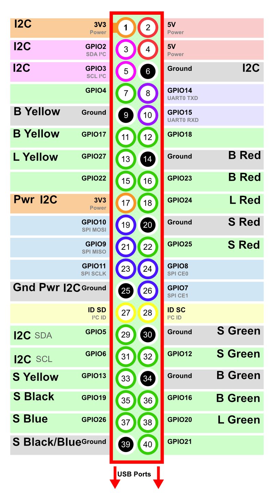
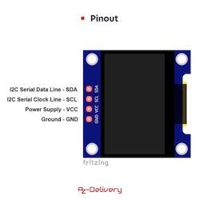

# ScrabScrap v2 Hardware-Installation

## Teileliste

* Raspberry PI 3
* [Raspberry PI Camera (AZDelivery Kamera für Raspberry Pi) v1.3](https://www.amazon.de/AZDelivery-Kamera-Flexkabel-Raspberry-Gratis/dp/B07KSZW251)
* Anschluss-Kabel Raspberry PI Camera
* [Button mit LED Grün/Gelb/Rot (EG STARTS 10x neue LED beleuchtet Arcade-Tasten mit Mikroschalter Mame Multicade)](https://www.amazon.de/gp/product/B01N549IDL)
* Schalter Grün
* Schalter Rot
* Schalter Gelb, Schwarz, Blau
* [Multiplexer I2C (AZDelivery PCA9548A I2C Multiplexer 8-Kanal-Multiplexer)](https://www.amazon.de/AZDelivery-TCA9548A-Multiplexer-8-Kanal-Multiplexer-kompatibel/dp/B086W7SL63)
* [2 * Display (AZDelivery 5 x 0,96 Zoll OLED Display I2C SSD1306 Chip 128 x 64 Pixel)](https://www.amazon.de/AZDelivery-Display-Arduino-Raspberry-Gratis/dp/B074NJMPYJ)
* [RTC (AZDelivery Real Time Clock RTC DS3231 I2C)](https://www.amazon.de/AZDelivery-RTC-Batterie-inklusive-Arduino/dp/B01M2B7HQB)
* Kabel & Stecker

\pagebreak

## Anschluss an die Raspberry PI GPIO

* Button Gelb mit LED  
  PIN 9, 11, 13 (GPIO Gnd, 17, 27)
* Button Rot mit LED  
  PIN 35, 37, 39 (GPIO 19, 26, Gnd)
* Button Grün mit LED  
  PIN 34, 36, 38 (GPIO Gnd, 16, 20)
* Switch Rot  
  PIN 30, 32 (GPIO Gnd, 12)
* Switch Grün  
  PIN 20, 22 (GPIO Gnd, 25)
* Switch Gelb  
  PIN 18, 14 (GPIO Gnd, 24)
* Switch Blau  
  PIN 16, 14 (GPIO Gnd, 23)
* Switch Schwarz  
  PIN 12, 14 (GPIO Gnd, 18)
* Stromversorgung: ein Anschuß wird gegabelt auf 4 Anschlüsse  
  PIN 17, 25 (GPIO Gnd, 3V3)
* I2C Multiplexer  
  PIN 1, 3, 5, 6 (GPIO 3V3, 2, 3, Gnd)

__Hinweis__ Die eingebauten LEDs der Button benötigen keinen Vorwiderstand. Werden diese ersetzt,
so müssen geeignete Vorwiderstände ergänzt werden.

\pagebreak

## Anschluss an den Muliplexer

| Multiplexer                                  | OLED                             |
|----------------------------------------------|----------------------------------|
|    |  |

### Anschluss Raspberry PI an Multiplexer

| Raspberry PI       | Multiplex |
|--------------------|-----------|
| PIN 1 (GPIO 3V3)   | VCC       |
| PIN 3 (GPIO 2/SDA) | SDA       |
| PIN 5 (GPIO 3/SCL) | SCL       |
| PIN 6 (GPIO Gnd)   | Gnd       |

### Anschluss OLED (Display 1 - Grün) an Multiplexer

| OLED | Raspberry PI          | Multiplex |
|------|-----------------------|-----------|
| SDA  |                       | SD0       |
| SCL  |                       | SC0       |
| VCC  | RPI PIN 17 (GPIO 3V3) |           |
| Gnd  | RPI PIN 25 (GPIO Gnd) |           |

### Anschluss OLED (Display 2 - Rot) an Multiplexer

| OLED | Raspberry PI          | Multiplex |
|------|-----------------------|-----------|
| SDA  |                       | SD1       |
| SCL  |                       | SC1       |
| VCC  | RPI PIN 17 (GPIO 3V3) |           |
| Gnd  | RPI PIN 25 (GPIO Gnd) |           |

### Anschluss RTC an Multiplexer

| OLED | Raspberry PI          | Multiplex |
|------|-----------------------|-----------|
| SDA  |                       | SD2       |
| SCL  |                       | SC2       |
| VCC  | RPI PIN 17 (GPIO 3V3) |           |
| Gnd  | RPI PIN 25 (GPIO Gnd) |           |

## Schaltplan

## Aufbau des Kamera-Arms
